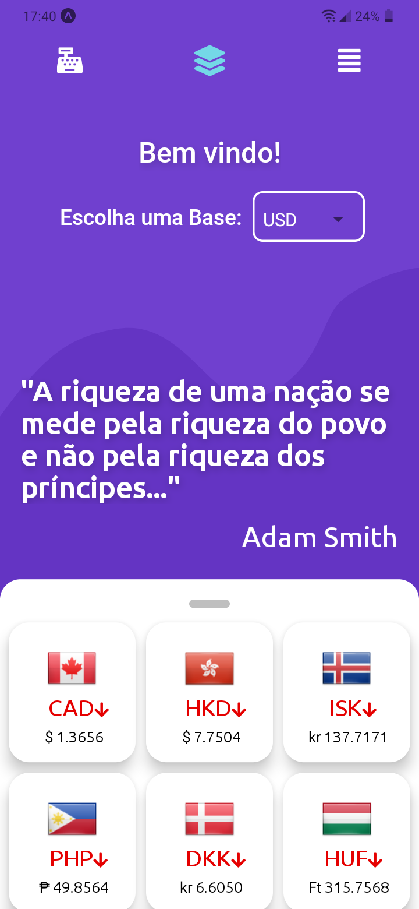
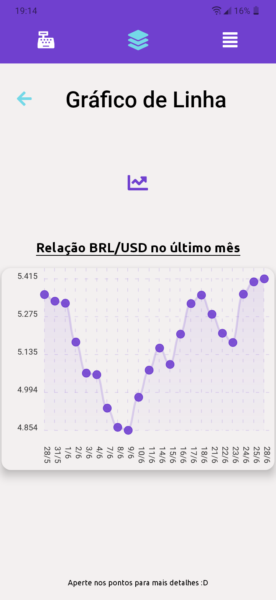

<h1> MoneyConvert </h1>

> <p align="center"> Converções e cotações de moedas.</p> 


<p align="center">
    Com o <b>MoneyConvert</b> é possivel acompanhar cotações diariamente,<br>comparar moedas através de gráficos e realizar a converção de câmbio
</p>

<p align="center">
    
    
  
</p>

## Instalação

<strong>Itens necessarios</strong>

1. npm ou yarn
2. expo
3. Um emulador Android/IOS ou dispositivo móvel.

<p>
Primeiramente clone o repositorio em seu ambiente de desenvolvimento. Após, execute o seguinte comando:
</p> 

```sh
npm install (ou) yarn install
```

<p>Depois, execute:</p>
```sh
expo start
```
<p>
Pronto, agora apenas siga as instruções do expo e execute o aplicativo no emulador ou no dispositivo fisico :D
</p>

## Atualizações futuras:
1. Adicionar feature que permite o usuario ver cotações por periodos de tempo.
2. Adicionar outros temas de fundo para a aplicação (dark/light).
3. Adicionar opção para o usuario escolher as cotações iniciais quando a aplicativo é iniciado.
4. Adicionar tutorial inicial.


## Redes Sociais e Contato
1. [Twitter](https://twitter.com/andr3zinh000)
2. Gmail: andrelp1015@gmail.com

Obrigado por acompanhar o projeto :D


